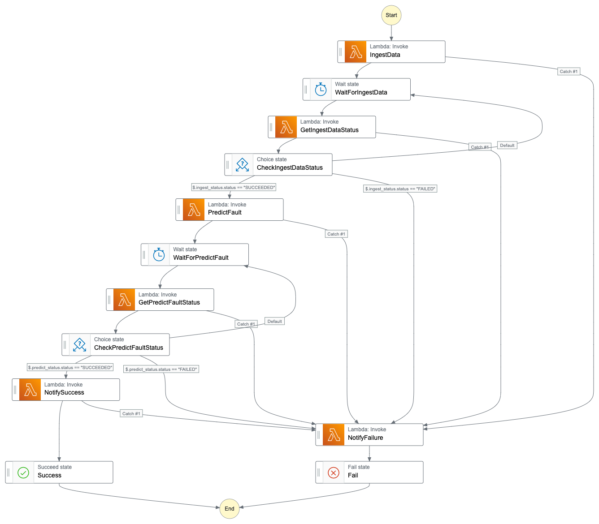

## Designing a workflow for fault detection and classification in photovoltaic systems

1. [Problem description](#problem-description)
2. [Data size estimate](#data-size-estimate)
3. [Architectural choices for data processing](#architectural-choices-for-data-processing)
  - [AWS Fargate on ECS](#aws-fargate-on-ecs)
  - [Amazon EMR Serverless Application](#amazon-emr-serverless-application)
  - [Amazon MSK Serverless Cluster](#amazon-msk-serverless-cluster)
  - [VPC Endpoint for S3](#vpc-endpoint-for-s3)
  - [Spark and Data Resources in Amazon S3](#spark-and-data-resources-in-amazon-s3)
4. [Fault Detection Algorithm Description](#fault-detection-algorithm-description)
5. [AWS Data Pipeline Diagram](#aws-data-pipeline)
  - [Spark job orchestration and state assessment with StepFunctions](#spark-job-orchestration-and-state-assessment-with-stepfunctions)
6. [CloudWatch Dashboard for EMR Serverless](#cloudwatch-dashboard-for-emr-serverless)
7. [Transition to a streaming application](#transition-to-a-streaming-application)
8. [Exploring alternative data technologies](#exploring-alternative-data-technologies)

## Problem description

Electrical faults in photovoltaic (PV) systems may evolve due to several abnormalities in internal configuration. We are presented with the task of **building an early detection and fault classification algorithm that uses the available electrical and environmental measurements from the sensors** deployed by most manufacturers of PV equipment.

Figure 1 shows a typical PV system configuration consisting of a 5 × 3 PV panel and a boost converter programmed with the MPPT algorithm to operate the PV module at the maximum power point (MPP). The locations of typical photovoltaic panel problems are shown symbolically.

<!-- <p align="center">
  
</p> -->

Normally each panel of the PV system is equipped with four sensors, namely: `voltage`, `current`, `temperature` and `irradiance` in addition to disconnection circuit and a servo motor. All of these components are connected to the microcontroller unit which periodically (every 20 seconds) send readings to the remote terminal unit followed by the SCADA (Supervisory control and data acquisition) system.

## Data size estimate
<a id="q2"></a>


The data represents the electrical and environmental readings of the 10k PV arrays installed in the solar plant system and contains the readings taken by the four sensors, together with the `deviceID` and `timestamp`. The following data is obtained from consuming Amazon Managed Streaming for Apache Kafka (MSK) topic:

```python
schema = StructType([
        StructField("deviceID", StringType(), True), # 10 alphanum chars UTF-8, 10 bytes
        StructField("timestamp", TimestampType(), True), # TimestampType in PySpark, 8 bytes
        StructField("voltage", FloatType(), True), # 4 bytes
        StructField("current", FloatType(), True), # 4 bytes
        StructField("temperature", FloatType(), True), # 4 bytes
        StructField("irradiance", FloatType(), True) # bytes
    ])
```
Each data point in binary format takes 10 + 8 + 16 = 34 bytes. To estimate the size of the data, we consider the size of each data point and the rate at which they are generated. Suppose the readings from 4 sensors installed on 10,000 solar panels are collected in the SCADA system every 20 seconds and consumed once every 24 hours.

Number of data points per device in 24 hours = (24 hours * 60 minutes/hour * 60 seconds/minute) / 20 seconds = 4,320. Total number of data points from all devices in 24 hours = 10,000 devices * 4,320 data points/device = 43,200,000 data points. Total daily batch size = 43,200,000 data points * 34 bytes/data point = 1,468,800,000 bytes = **1.47GB** or **1.37GiB** per day. According to the requirements, the data is collected once a day according to a schedule. So 10k PV panels will generate at least 1.47GB/day of binary efficient non-JSON data, while 100k devices will generate 14.7GB daily.

## Architectural choices for data processing

By the conditions of this task it was defined that the data are read in batches once a day. Each batch includes sensor readings from the SCADA system for the day preceding the day of the moment of pipeline execution.

Based on these inputs, we decided to build an event-driven data pipeline using recently released Amazon EMR (Elastic MapReduce) Serverless and Amazon Managed Streaming for Apache Kafka (MSK) Serverless for batch and streaming analytics with Apache Spark and Apache Kafka. We shall also use AWS Fargate in Elastic Container Services (ECS). 

Later, we will talk about the reasons for picking this services and compare them to other processing and data technologies available on the Amazon platform. Moreover we shall discuss what changes need to be made to convert this stack into real-time streaming application based on Spark Structured Streaming.

### AWS Fargate on ECS

ECS cluster with a Fargate task is a serverless container orchestration solution that enables us to deploy, manage, and scale containerized applications without the need to manage the underlying infrastructure. We define your application's container requirements in a task definition, create an ECS service to run and maintain the tasks, and Fargate handles the rest.

**The primary task of the Kafka client container application deployed in ECS is to retrieve, parse data and publish messages to the Amazon MSK topic**.

We start by creating a container image containing Apache Kafka Streams API files and our custom scripts. These scripts will retrieve the data from the remote SCADA system, apply parsing and use Kafka Producer APIs to publish messages to the Amazon MSK topic. The topic is partitioned by `key=deviceID`, which is the serial number of the photovoltaic panel. The data in the message field of the topic is stored using the efficient AVRO format. As we mentioned above the published data includes the readings taken by the `voltage`, `current`, `temperature` and `irradiance` sensors, together with the `deviceID` and `timestamp`.

We create a Docker image `kafka-streams-msk` based on `adoptopenjdk/openjdk11:jre-11.0.10_9-alpine` and include the *.jar files required by Kafka. 
Since the base container already includes the JDK, and to keep things lean, it makes sense to write the SCADA data retrieval routines in Java and use the Kafka Producer Java APIs.

We retrieve an authentication token, authenticate Docker client to registry, tag and push image to the Amazon ECR repository:
```
aws ecr get-login-password --region <<region>> | docker login --username AWS --password-stdin <<account_id>>.dkr.ecr.<<region>>.amazonaws.com
docker tag kafka-streams-msk:latest  <<account_id>>.dkr.ecr.<<region>>.amazonaws.com/kafka-streams-msk:latest 
docker push <<account_id>>.dkr.ecr.<<region>>.amazonaws.com/kafka-streams-msk:latest 
```

Next we use CloudFormation template to create ECS cluster, Fargate task, and service definitions.  When the CloudFormation stack is complete, it automatically deploys our applications. 

### Amazon EMR Serverless Application

The creation of the EMR Serverless Application includes the following resources:
1. Amazon S3 Bootstrap bucket for storage of Spark resources;
2. Amazon VPC with at least two private subnets and associated Security Group(s);
3. EMR Serverless runtime AWS IAM Role and associated IAM Policy;
4. Amazon EMR Serverless Application;

For this task, we use EMR Studio Serverless Application console to create a Spark application.

EMR Serverless provides a **pre-initialized capacity** feature that keeps workers initialized and ready to respond in seconds. This capacity effectively creates a warm pool of workers for an application. When you configure pre-initialized capacity, jobs can start immediately so that you can implement iterative applications and time-sensitive jobs.

Since we are connecting to MSK Serverless from EMR Serverless, we need to configure VPC access. We need to create VPC and at least two private subnets in different Availability Zones (AZs). According to the documentation, the subnets selected for EMR Serverless must be private subnets. The associated route tables for the subnets should not contain direct routes to the Internet.

Currently EMR Serverless only includes Spark and Hive as pre-installed applications, unlike EMR on EC2/EKS which includes massive selection of libraries. However, this issue is addressed by creating a custom Docker image based on the existing `emr-serverless/spark/emr-6.9.0` and adding TensorFlow, NumPy, Pandas and PyWavelets to it.

1. Create a Dockerfile with the following contents:
```
FROM public.ecr.aws/emr-serverless/spark/emr-6.9.0:latest

USER root

# python packages
RUN pip3 install boto3 ec2_metadata
RUN pip3 install numpy pandas pywt tensorflow

# EMR Serverless will run the image as hadoop
USER hadoop:hadoop    
```

2. Build the Docker image 
```shell
docker build -t my-emr-serverless-spark:latest .
```

3. Push image to Amazon Elastic Container Registry (ECR) 
```shell
aws ecr create-repository --repository-name my-emr-serverless-spark
docker tag my-emr-serverless-spark:latest <account_id>.dkr.ecr.<region>.amazonaws.com/my-emr-serverless-spark:latest
aws ecr get-login-password --region <region> | docker login --username AWS --password-stdin <account_id>.dkr.ecr.<region>.amazonaws.com
docker push <account_id>.dkr.ecr.<region>.amazonaws.com/my-emr-serverless-spark:latest
```

4. Reference the custom Docker image in your EMR Serverless job configuration.

```json
{
  "containerInfo": {
    "eciConfig": {
      "repositoryUri": "<account_id>.dkr.ecr.<region>.amazonaws.com/my-emr-serverless-spark:latest"
    }
  }
}
```

### Amazon MSK Serverless Cluster

The creation of the MSK Serverless Cluster includes the following resources:

1. AWS IAM Role and associated IAM Policy for the Amazon EC2 Kafka client instance;
2. VPC with at least one public subnet and associated Security Group(s); ??
3. We use Fargate on ECS as Apache Kafka client;
4. Amazon MSK Serverless Cluster;

We  associate the new MSK Serverless Cluster with the EMR Serverless Application’s VPC and two private subnets. Also, associate the cluster with the Fargate-based Kafka client instance’s VPC and its subnet.


### VPC Endpoint for S3

To access the Spark resource in Amazon S3 from EMR Serverless running in the two private subnets, we need a VPC Endpoint for S3. Specifically, a Gateway Endpoint, which sends traffic to Amazon S3 or DynamoDB using private IP addresses. A gateway endpoint for Amazon S3 enables you to use private IP addresses to access Amazon S3 without exposure to the public Internet. EMR Serverless does not require public IP addresses, and we don’t need an internet gateway (IGW), a NAT device, or a virtual private gateway in VPC to connect to S3.

We make the VPC Endpoint for S3 (Gateway Endpoint) and add the route table for the two EMR Serverless private subnets.

### Spark and Data Resources in Amazon S3

We create several S3 buckets to facilitate our storage requirements.

1. Bootstrap bucket containing files described below.
2. Silver bucket stores intermediate Parquet files generated by the Spark job.
3. Gold bucket stores the resulting dataset along with the predictions.
4. Log bucket stores EMR process application logs.

To submit and run the Spark Jobs included in the project, we will need to copy the following resources to S3 Bootstrap bucket: 2 Apache Spark jobs, 5 related JAR dependencies, and pre-trained CNN model in H5 file. To start, copy the five PySpark applications to a `spark/` subdirectory within Bootstrap S3 bucket.

PySpark applications have a handful of JAR dependencies that must be available when the job runs, **which are not on the EMR Serverless classpath by default.** To make sure which JARs are already on the EMR Serverless classpath, you can check the Spark UI’s [Environment](https://spark.apache.org/docs/3.1.2/web-ui.html#environment-tab) tab’s Classpath Entries section.

It is critical to choose the correct version of each JAR dependency based on the version of libraries used with the EMR and MSK. Using the wrong version or inconsistent versions, especially Scala, can result in job failures. Specifically, we are targeting Spark 3.2.1 and Scala 2.12 (EMR v6.7.0: Amazon’s Spark 3.2.1, Scala 2.12.15, Amazon Corretto 8 version of OpenJDK), and Apache Kafka 2.8.1 (MSK Serverless: Kafka 2.8.1).

```shell
# dependencies
wget https://github.com/aws/aws-msk-iam-auth/releases/download/v1.1.4/aws-msk-iam-auth-1.1.4-all.jar
wget https://repo1.maven.org/maven2/org/apache/commons/commons-pool2/2.11.1/commons-pool2-2.11.1.jar
wget https://repo1.maven.org/maven2/org/apache/kafka/kafka-clients/2.8.1/kafka-clients-2.8.1.jar
wget https://repo1.maven.org/maven2/org/apache/spark/spark-sql-kafka-0-10_2.12/3.2.1/spark-sql-kafka-0-10_2.12-3.2.1.jar
wget https://repo1.maven.org/maven2/org/apache/spark/spark-token-provider-kafka-0-10_2.12/3.2.1/spark-token-provider-kafka-0-10_2.12-3.2.1.jar
```
Then we download JAR files locally, then copy them to a `jars/` subdirectory within S3 Bootstrap bucket.


## Fault Detection Algorithm Description

Please read [Fault Detection and Classification in Photovoltaic Arrays](<fault_detection_and_classification.md>) and [Wavelet Transformation introduction](<wavelet_transform_intro.md>) if you interested in more information regarding method presented below.

1. The first script `ingest_data.py` consumes the batch data from the Kafka topic for 24 hours of the previous day using PySpark. We use the `startingTimestamp` and `endingTimestamp` Spark Kafka consumer parameters to filter out messages based on requirement we have.

2. Next, Continuous Wavelet Transform signal processing applied to each of the 4 time series on a per-device basis using the Morlet mother wavelet with a scale of 64. Resulting 2D scalograms are stacked like channels of a color image, making them suitable for feeding into a CNN with LeNet-5 architecture for 64x64 pixel images.

3. It then stores the processed data in a parquet file in the `silver` staging bucket. The Kafka bootstrap server and port, and the location of the silver bucket are obtained from the arguments provided by calling the lambda function. 

4. The second script `predict_fault.py` reads data from the `silver` bucket and transforms it into the form required by the neural network.

5. Uses the pre-trained LeNet-5 CNN model file from the `bootstrap` bucket to predict whether a given panel is under certain fault conditions, such as Line-Line, Line-Ground, Open Circuit, Partial Shading, Arc Fault or none.

6. Stores the data in the `gold` bucket along with the predictions. The locations of the `bootstrap`, `silver` and `gold` buckets are passed by calling the lambda function.

7. From the `gold' bucket, the data is accessible via the API gateway, which handles communication with a `QueryResults' lambda function that queries the parquet file using the PyArrow library using `deviceID' and returns the JSON result of the prediction.

The steps above imply use of **PySpark**, **TensorFlow**, **PyWavelets** and **PyArrow** libraries to achieve the intended result.

## AWS Data Pipeline 

With the Fargate containers, EMR Serverless Application, MSK Serverless Cluster, Kafka topics created, and the Spark resources and bootstrap scripts and libraries uploaded to Amazon S3, we are ready to explore our pipeline.

At the heart of the workflow is the **AWS StepFunctions** state machine. It orchestrates Spark jobs and handles failures and retries. Its execution is triggered by the event scheduled in the **EventBridge**.


#### Spark job orchestration and state assessment with StepFunctions



- `IngestData` **task** state triggers a Lambda function [`ingest_data`](<src/lambda/ingest_data_lambda.py>) which gets necessary parameters from Parameter Store and executes the [`ingest_data.py`](<src/lambda/ingest_data_lambda.py>) script from S3 `bootstrap` bucket on an EMR Serverless cluster to consume data from a MSK topic. The function takes care of submitting the EMR job and returns the `job_id` for use downstream. If the function encounters an error, it will retry up to 6 times with an exponential backoff strategy. If all retries fail, it moves to the `NotifyFailure` state. 

- To submit PySpark job to the EMR Serverless Application, we use the `emr-serverless` API from the AWS SDK.  We will need 4 values: 
  1. EMR Serverless Application’s `application-id`, 
  2. the ARN of your EMR Serverless Application’s execution IAM Role, 
  3. MSK Serverless bootstrap server (host and port), and 
  4. the name of your Amazon S3 Bootstrap bucket containing the Spark resources.

- `WaitForIngestData` **wait** state pauses the state machine for the specified number of seconds in `$.wait_time` before moving to the next state. `$.wait_time` is passed as input parameter to the StepFunction by EventBridge script. This wait time is used to avoid polling the EMR job status too frequently. 

- `GetIngestDataStatus` **task** state triggers a Lambda function [`get_ingest_data_status`](<src/lambda/get_ingest_data_status_lambda.py>) to retrieve the status of an EMR job by calling `get_job_run` method on the EMR Serverless client and passing job ID. If the function encounters an error, it will retry up to 6 times with an exponential backoff strategy. If all retries fail, it moves to the `NotifyFailure` state.

- `CheckIngestDataStatus` **choice** state evaluates the status of data ingestion. If it has succeeded, it moves to the `PredictFault` state. If it has failed, it moves to the `NotifyFailure` state. If the status is unknown, it moves back to the `WaitForIngestData` state.

- [`PredictFault`](<src/lambda/predict_fault_lambda.py>), `WaitForPredictFault`, [`GetPredictFaultStatus`](<src/lambda/get_predict_fault_status_lambda.py>), `CheckPredictFaultStatus` states repeat the same pattern as the steps above, including submitting the second Spark job [`predict_fault.py`](<src/spark/predict_fault.py>) to EMR Serverless via lambda function call and monitoring its execution state.

- `NotifySuccess` **task** state triggers a Lambda function [`notify_success`](<src/lambda/notify_success_lambda.py>) to send a notification about the successful completion of the Spark jobs. 

- `NotifyFailure` **task** state triggers a Lambda function [`notify_failure`](<src/lambda/notify_failure_lambda.py>) to send a notification about the **failure of any of the previous steps**. 

#### Advantages of using the StepFunctions approach:

- **Error handling**: Errors are managed at each Task state, providing a robust way to handle failures.
- **Retries**: Failed Lambda functions are retried with an exponential backoff strategy, reducing the impact of transient errors.
- **Status monitoring**: Continuous checks of Spark job statuses are performed, with appropriate actions taken based on each job's status.
- **Orchestration**: Step Functions simplify complex workflow management by breaking them into smaller, more manageable states.
- **Modularity**: With each state in the workflow having a specific purpose, the overall process becomes easier to understand.
- **Scalability and cost-effectiveness**: The service scales automatically with workload, charging only for what you use, making it a cost-effective choice for managing workflows

As of Feb 17, 2023 AWS Step Functions adds integration for 35 services including EMR Serverless. Per [Amazon press statement](<https://aws.amazon.com/about-aws/whats-new/2023/02/aws-step-functions-integration-35-services-emr-serverless/>):
> By directly invoking AWS services or their API actions from AWS Step Functions, customers can write less code, simplify their architecture and save costs. The newly supported direct integrations include Amazon EMR Serverless ... In addition, Step Functions also added support for 1000+ new API actions from new and existing AWS services such as Amazon DynamoDB and Amazon Athena.

This will enable StepFunctions to directly launch EMR serverless jobs in future iterations of this workflow without using Lambda functions as an intermediary.

## CloudWatch Dashboard for EMR Serverless

We also deployed [CloudWatch Dashboard](<cloudformation/emr_serverless_cloudwatch_dashboard.yaml>) for Spark applications on EMR Serverless. The CloudWatch Dashboard provides an overview of pre-initialized capacity vs. OnDemand as well as drill-down metrics for CPU, memory, and disk usage for Spark Drivers and Executors. Pre-initialized capacity is an optional feature of EMR Serverless that keeps driver and workers pre-initialized and ready to respond in seconds and this dashboard can help understand if pre-initialized capacity is being used effectively.  In addition, you can see job-level metrics for the state of your jobs on a per-application basis.

Cloudwatch Dashboard provides timeline for the following metrics:

| Group | Description | Metric 1 | Metric 2 | Metric 3 | Metric 4 |
| --- | --- | --- | --- | --- | --- |
| Capacity Utilization Snapshot view | Shows current Pre-Initialized vs. OnDemand usage | Pre-Initialized Capacity Worker Utilization % | Available Workers (Drivers + Executors) | Running Drivers | Running Executors |
| Application | Shows capacity used by your application | Running Workers | CPU Allocated | Memory Allocated | Disk Allocated |
| Pre-Initialized Capacity | Shows how utilized the pre-initialized capacity is| Total Workers | idle Workers | Pre-Initialized Capacity Worker Utilization % (Workers used / Total Workers) | |
| Driver Metrics | | Running Drivers | CPU Allocated | Memory Allocated | Disk Allocated  |
| Executors Metrics | | Running Executors | CPU Allocated | Memory Allocated | Disk Allocated  |
| Job Metrics | | Running Jobs | Success Jobs | Failed Jobs | Cancelled Jobs |
| Job Runs | Aggregate view and point in time counters of job states for your application per minute | Pending jobs counter | Running jobs counter | Failed jobs counter |


## Transition to a streaming application

This workflow can also be reused in the future for applications that require SCADA system data processing and fault detection analysis of solar operation on a continuous basis. To convert this pipeline into a near real-time streaming application, we rely on Spark Structured Streaming.

Structured Streaming is a scalable and fault-tolerant stream processing engine built on the Spark SQL engine. You can express your streaming computation the same way you would express a batch computation on static data. The Spark SQL engine will take care of running it incrementally and continuously and updating the final result as streaming data continues to arrive. With Structured Streaming, you should be aware that these Spark jobs run continuously. In other words, the streaming jobs will not stop; they continually await more streaming data. Obviously, this is much more expensive than the event-driven method of batch data processing.

We will use structured streaming to consume data from Apache Kafka with a tumbling event-time window in real time. We will switch from batch to stream reading - from `read()` to `readstream()` and from `write()` to `writestream()`. We then apply the CWT transformation to the data bucketed within this window. The results are fed into a predictive model. The processed dataset, where each device state within a given interval is classified into 6 fault types, is exposed via a web service for use in the analytical dashboard and predictive maintenance reporting. This provides users with fast and granular PV array status updates.

## Exploring alternative data technologies

<!-- 
SSM PARAMS

kafka-servers
kafka-topics
sns-topic
log-bucket
silver-bucket
gold-bucket
emr-app-id 
-->