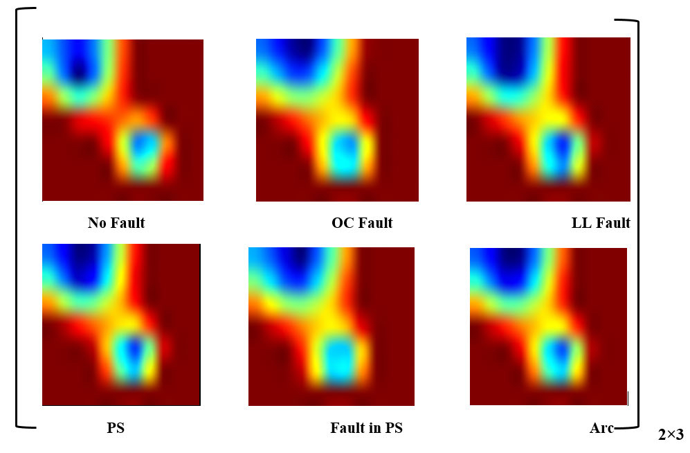
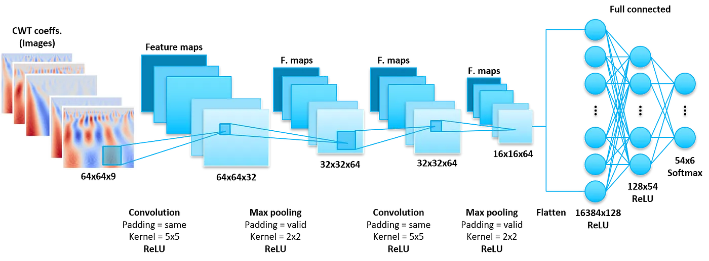
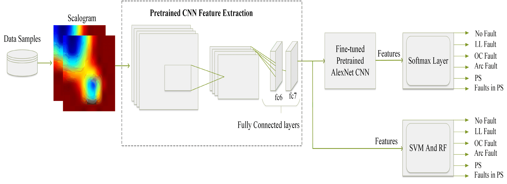

## Algorithm: Combination of signal processing and convolutional neural network.

For modelling we combine methods #1 and #5 from the [electrical fault diagnosis methods](<fault_detection_and_classification.md>):

### 1. **Statistical and Signal Processing** with Continuous Wavelet Transformation (CWT) 

First, we will use the [Continuous Wavelet Transformation](<wavelet_transform_intro.md>) to convert time series measurements of voltage, current, temperature and irradiance into four coefficient matrices.

As opposed to Fast Fourier Transform (FFT) which only provides frequency information but loses time information, Wavelet Transform allows simultaneous analysis of **both time and frequency**. This is particularly useful for non-stationary signals, where the frequency content changes over time.

The result of applying CWT to time series data are 2D matrices called "scalograms". The level of details is controlled by the "scale" parameter. The scale factor corresponds to how much a signal is scaled in time and is inversely proportional to frequency.

On figure 2 Visualization of ‘‘average scalograms’’ for six fault classes.

### 2. **Convolutional Neural Network** (CNN) for multi-class fault classification

Second part our approach is based on the use of a LeNet-style convolutional neural network (CNN) to predict whether a given panel is under certain fault conditions, such as Line-Line, Line-Ground, Open Circuit, Partial Shading, Arc Fault or none, by extracting features from two-dimensional (2-D) scalograms generated in real time by the PV data acquisition system.

An equally viable option is to use transfer learning by fine-tuning the last fully connected layer of the pre-trained AlexNet CNN and modifying its architecture to get only last 6 neurons which represent our 6 fault classes.

Third option is using Principal Components Analysis (PCA) to select the most important coefficients per scale to feed them to XGBoost classifier. 

We will use CNNs because they are very efficient at learning characteristic patterns of labels in images. This type of neural network can also treat the 2D CWT coefficients as pixels of an image to predict the corresponding activity.

To transform the signals of the solar PV dataset using the `pywt.cwt()` function, we choose the Morlet mother wavelet and a scale size of 64.

It is important to clarify how to feed the resulting CWT coefficient matrices into the CNN. The best approach here is to **layer the 2D coefficients** (images) of the four signals like the three Red, Green, Blue (RGB) channels of a color image. This allows all the **dependencies between the different sensor data to be taken into account simultaneously**, which is very important.

The final step is to normalize and transform the data into the shape the neural network expects and apply the stored pre-trained model to classify and detect 6 types of faults.

With an accuracy of more than 90%, it can be concluded that the combination of CWT and CNN is a reasonable option for the classification of non-stationary multiple time series/signals.

By improving the CNN (adding regularization, more neurons, etc.), different CNN architectures, hyperparameter tuning, or different scale sizes (with or without down-sampling), better results can be achieved.