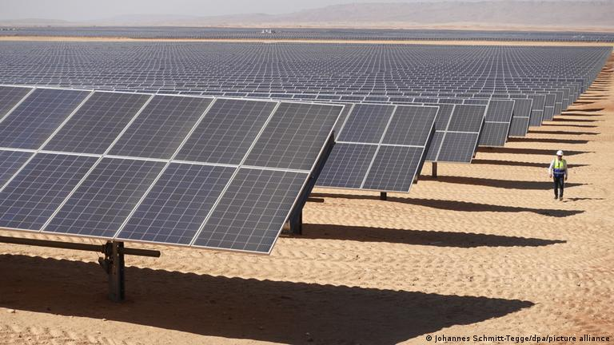
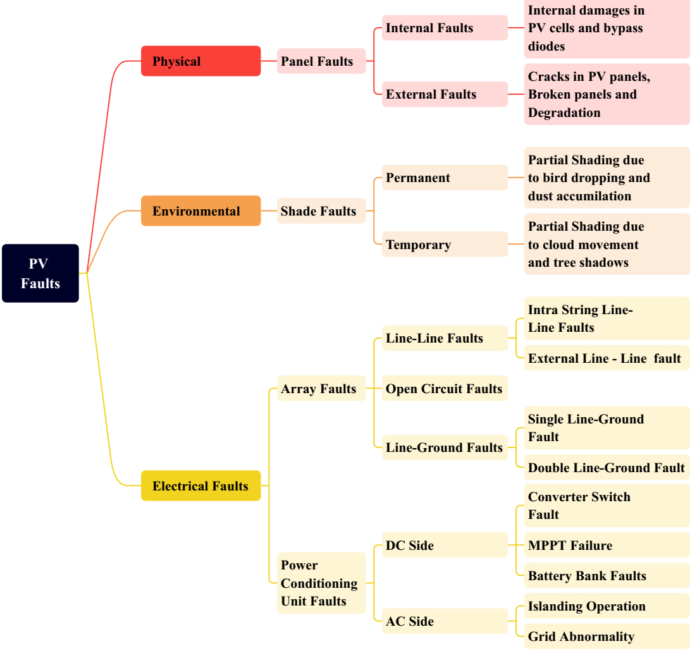

## Fault Detection and Classification in Photovoltaic Arrays

  

<!-- -->

Renewable energy already accounts for a large part of the energy market. In recent decades, solar photovoltaic (PV) energy has rapidly captured a large number of markets due to its global availability, modularity, non-pollution, ease of installation, and affordability. Much progress has been made in the study of PV systems, especially in terms of efficiency, cost, and obtaining maximum available power from PV cells. Nevertheless, PV systems are often subject to a variety of types of faults, which can seriously affect the safe operation and conversion efficiency of the systems

The Energy Audit Report shows an annual energy loss of up to 18.9% due to PV system faults in the UK alone. Furthermore, the fault diagnosis of PV systems also yields numerous economic benefits. Therefore, it is necessary to focus attention on this task.

Faults in photovoltaic (PV) systems are mainly PV system component faults, which originate from dirty modules, sand or snow cover, local shading, module aging, and basic component manufacturing. The typical faults that occur in PV systems are shown in Figure 1, and can be divided into three types, namely, **physical**, **chemical**, and **electrical** faults.

To investigate and mitigate the aforementioned faults, National Electric Code (NEC) recommends the use of Ground Fault Protection Device, Over Current Protection Device and arc Fault Circuit Interrupter to detect Line-Line, Line-Ground and Arc faults respectively. However, the incompatibility of such protection devices is portrayed in comprehensive studies. 

Specifically, the nonlinear characteristics of PV arrays, low irradiance, maximum power point tracker, faults impedance, degradation and presence of blocking diodes are some factors that prevent protection devices to trip under certain conditions. Hence, sometime faults may go undetected for a long time, showing practical limitations of conventional protection schemes in PV arrays.

### Fault diagnosis methods

In general, there are two kinds kinds of fault diagnosis methods, i.e., **electrical methods**, and **thermal and visual methods**. 

The **visual and thermal methods** (infrared, thermal imagining, and thermal IR video) work well for PV panel hot-spot detection, yet require high initial investment in cameras or in fleet of unmanned aerial vehicles (UAV).

The **electrical methods** can be can be further classified into: 
1. **Statistical and signal processing** identifies faults by analyzing signals such as power data in a time in a series. This method has a high corrent diagnostic rate but requires many pre-processed data and a complex analysis process.
2. **Power loss analysis** achieves this by analyzing the output power loss on the DC side of PV systems, which reduces the computational and simulation costs, but does not distinguish the exact type of fault.
3. **Voltage and current measurement** detects the occurrence of faults by measuring the relevant voltage and current data, and comparing them with those in normal operation. This method is intuitive and simple, but the diagnostic accuracy is not high.
4. **I–V curve** can reveal the changes in a PV module. The module changes when different faults occur, and the faults can be identified by comparing the curve under the same external conditions. Fault analysis using I–V is intuitive and can help verify the health of a PV module during commissioning.
5. **Machine Learning and Artificial Neural Networks** techniques achieve automatic fault diagnosis by analysing a large amount of data. Compared with other methods, ML & ANN has a wider scope of application, not only for electrical parameters, but also for images and other information. It has advantages such as high diagnostic accuracy, low cost, accurate classification of fault types and better diagnostic performance for complex faults.
