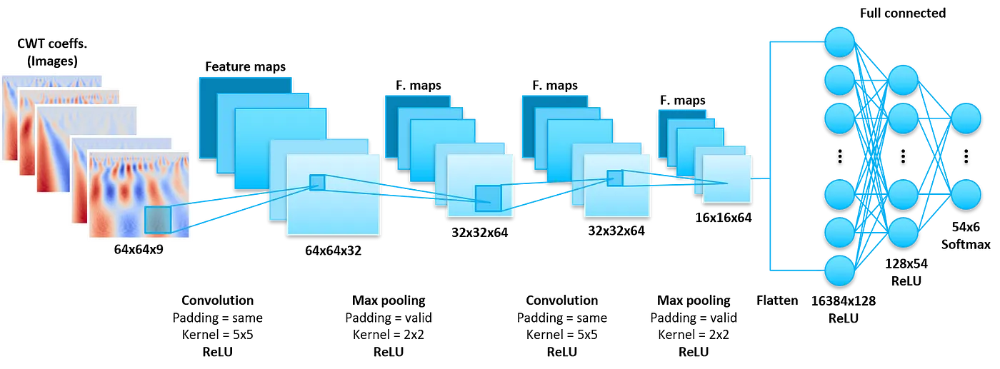

## Python code: lenet_cnn.py
#solar_pipeline

#### As a point of reference, the architecture of the LeNet CNN is presented below, if we needed to fit on the labelled data



- Max pooling instead of average pooling, because max pooling may reach a better performance when you would like to extract the extreme features (abrupt changes) and when the images have a high pixel density (due to the nine channels).
- Rectified linear unit (ReLU) activation function instead of hyperbolic tangent (Tanh) to overcome the vanish gradient problem, accelerate the training and achieve better performance.

In order for this model to be functional it must be trained on a labelled data set. Such a dataset is one where for each device and the four feature matrices obtained after wavelet transformation, an unambiguous relationship with the type of fault or lack thereof is established.

Such annotated data sets containing information about solar panels used in PV plants, sensor readings and corresponding states contain proprietary information and are not publicly available.

```python
# Purpose: LeNet5 CNN 64x64 reference implementation. 
# For demonstration purposes only.
# Author:  VK
# Date: 2023-05-05

import tensorflow as tf
from tensorflow import keras
from tensorflow.keras.models import Sequential
from tensorflow.keras.layers import Dense, Activation, Flatten
from tensorflow.keras.layers import Conv2D, MaxPooling2D
from tensorflow.keras.callbacks import ModelCheckpoint

def build_cnn_model(activation, input_shape):
    model = Sequential()
    
    # Convolution layer with Max polling
    model.add(Conv2D(32, 5, activation = activation, padding = 'same', input_shape = input_shape))
    model.add(MaxPooling2D())
    model.add(Conv2D(64, 5, activation = activation, padding = 'same', kernel_initializer = "he_normal"))
    model.add(MaxPooling2D())  
    model.add(Flatten())
    
    # Fully connected layers
    model.add(Dense(128, activation = activation, kernel_initializer = "he_normal"))
    model.add(Dense(54, activation = activation, kernel_initializer = "he_normal"))
    model.add(Dense(6, activation = 'softmax')) # 6 classes of faults
    
    # summarize the model
    print(model.summary())
    return model

def compile_and_fit_model(model, X_train, y_train, X_test, y_test, batch_size, n_epochs):

    # compile the model
    model.compile(
        optimizer=tf.keras.optimizers.Adam(),
        loss='sparse_categorical_crossentropy',
        metrics=['sparse_categorical_accuracy'])
    
    # define callbacks
    callbacks = [ModelCheckpoint(filepath='le_net_2023_6_class.h5', monitor='val_sparse_categorical_accuracy', save_best_only=True)]
    
    # fit the model
    history = model.fit(x=X_train,
                        y=y_train,
                        batch_size=batch_size,
                        epochs=n_epochs,
                        verbose=1,
                        callbacks=callbacks,
                        validation_data=(X_test, y_test))
    
    return model, history

# shape of the input images
input_shape = (64, 64, 4)
# input_shape = (X.shape[1], X.shape[2], X.shape[3])

# create cnn model
cnn_model = build_cnn_model("relu", input_shape)
# train cnn model
trained_cnn_model, cnn_history = compile_and_fit_model(cnn_model, X_train_cwt, y_train, X_test_cwt, y_test, 368, 10)
```