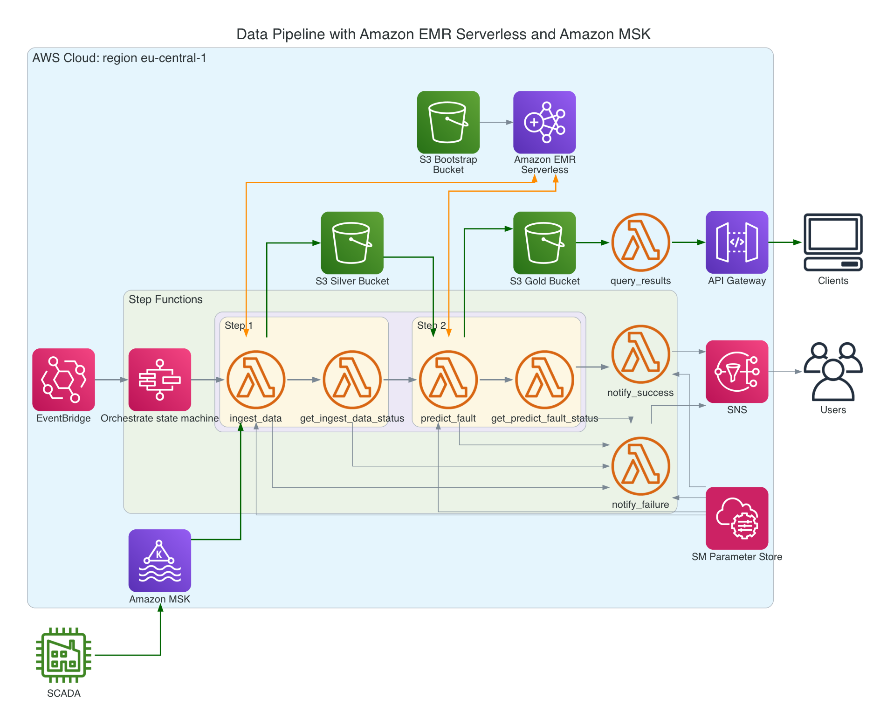
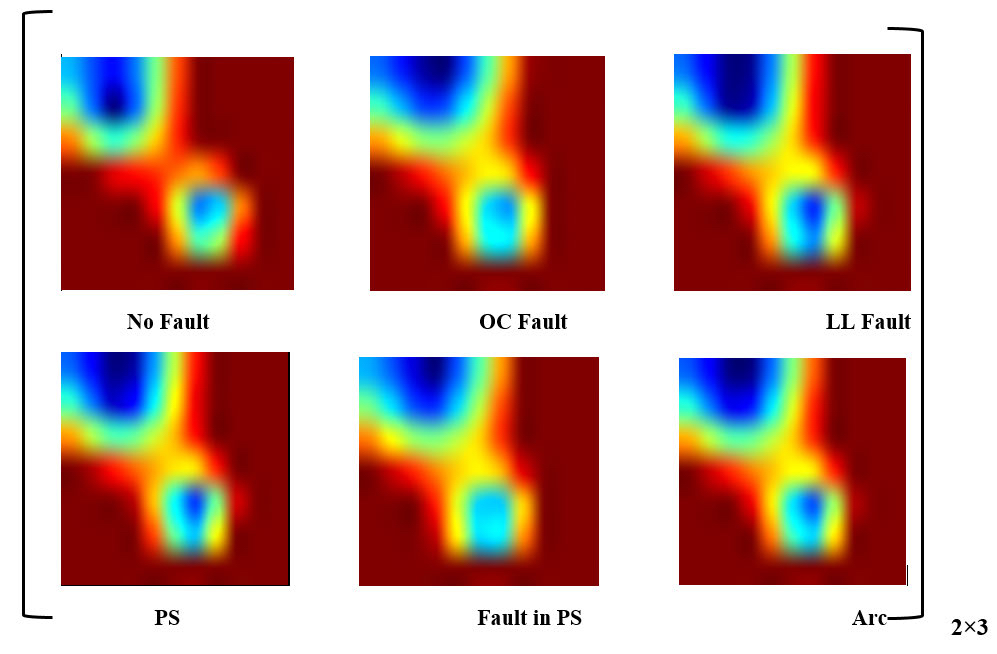

## Problem description

Electrical faults in PV systems may evolve due to several abnormalities in internal configuration. We are presented with the task of **building an early detection and fault classification algorithm that uses the available electrical and environmental measurements from the sensors** deployed by most manufacturers of PV equipment.

Figure 1 shows a typical PV system configuration consisting of a 5 × 3 PV panel and a boost converter programmed with the MPPT algorithm to operate the PV module at the maximum power point (MPP). The locations of typical photovoltaic panel problems are shown symbolically.


Normally each panel of the PV system is equipped with four sensors, namely: `voltage`, `current`, `temperature` and `irradiance` in addition to disconnection circuit and a servo motor. All of these components are connected to the microcontroller unit which periodically (every 20 seconds) send readings to the remote terminal unit followed by the SCADA (Supervisory control and data acquisition) system.

### Incoming data 

The incoming data contains the readings from the four sensors, together with the `deviceID` and `timestamp`. Schema presented below:

```python
schema = StructType([
        StructField("deviceID", StringType(), True), # 10 alphanum chars UTF-8, 10 bytes
        StructField("timestamp", TimestampType(), True), # TimestampType in PySpark, 8 bytes
        StructField("voltage", FloatType(), True), # 4 bytes
        StructField("current", FloatType(), True), # 4 bytes
        StructField("temperature", FloatType(), True), # 4 bytes
        StructField("irradiance", FloatType(), True) # bytes
    ])
```
Each data point in binary format takes 10 + 8 + 16 = 34 bytes. To estimate the size of the incoming data stream, we consider the size of each data point and the rate at which they are generated. Assuming readings from 4 sensors deployed on 10,000 solar panels are collected into the SCADA system every 20 seconds for 24 hours.

Number of data points per device in 24 hours = (24 hours * 60 minutes/hour * 60 seconds/minute) / 20 seconds = 4,320. Total number of data points from all devices in 24 hours = 10,000 devices * 4,320 data points/device = 43,200,000 data points. Total daily batch size = 43,200,000 data points * 34 bytes/data point = 1,468,800,000 bytes = **1.47GB** or **1.37GiB** per day.

### Architectural choices for data pipeline in AWS

From a high-level overview, the data pipeline involves 2 steps: 

1. The first involves reading batch data from the Kafka topic with PySpark, applying wavelet signal processing independently for each device and each of the 4 time series, and saving the processed data to a parquet file in the `silver` staging bucket.

2. Second step involves reading data from `silver` bucket, transforming it into the shape required by neural network and using pre-trained TensorFlow model to classify state of each device into 1 of 6 conditions. The data is then stored in the `gold` bucket along with the predictions.

3. From there, data is accessible via API gateway, which gives access to lambda function that queries parquet based on deviceID and returns JSON result.

Thus, our case consists of batch processing of electrical and environmental readings from a solar PV plant with 10k solar panels, which are constantly added to the Kafka topic, but only consumed once a day. The main limiting factor is the second step of our pipeline, which requires the use of a pre-trained Tensorflow model to classify the datasets.

Although there are numerous data processing options available in AWS, we consider between AWS Glue, Amazon EMR on EC2/EKS or Amazon EMR Serverless (available in production since June 2022). 

AWS Glue is better suited for ETL workflows that require data discovery, preparation, and integration with other AWS services. While AWS Glue is perfect for most ETL tasks, there are some limitations on the size of dependencies for AWS Glue jobs. Although Glue supports third-party Python libraries, which you can install using the `--additional-python-modules' parameter, the maximum size of a single dependency file is 50MB, and the total size of all dependencies combined is 250MB. But, the TensorFlow pip package for Linux systems is about 500MB (TensorFlow Docker image is about 2 GB).

Amazon EMR on EC2/EKS or EMR Serverless are more appropriate for analytics applications that require high performance processing using open source tools. Since our task is a fairly short-term conversion, continuous operation of the EMR cluster is not financially viable.

Running EMR Serverless can be less expensive and faster than creating and terminating EMR clusters programmatically with AWS CLI or StepFunctions, especially for short-lived and sporadic computing tasks. This is due to the following reasons:

1. Pay-per-use pricing: With EMR Serverless, you only pay for the resources used during job execution, making it cost-efficient for infrequent or unpredictable workloads. You are not billed for idle time between jobs.

2. Resource allocation and scaling: EMR Serverless automatically scales resources based on workload, ensuring you only pay for what you need. In contrast, with EMR on EC2, you may need to over-provision resources to handle peak workloads or under-provision resources during off-peak periods.

Currently EMR Serverless only includes Spark and Hive as pre-installed applications, unlike EMR EC2/EKS where there is a massive selection of libraries. However, this issue is addressed by creating a custom docker image based on the existing `emr-serverless/spark/emr-6.9.0' and adding TensorFlow to it.




The data originates from SCADA system, which uses `kafka-producer` application to stream into Apache Kafka, deployed either on-premises or in the cloud. In our case - into Amazon Managed Streaming for Apache Kafka (Amazon MSK). The name of the input topic is `solar.data.segment.01`.

From Amazon MSK the data is ingested into Amazon EMR (Amazon Elastic MapReduce), a Spark/Hadoop/Hive cluster deployed on AWS. For this particular task, we chose a 24-hour batch window. So data is consumed from 0:00 to 23:59:59 the day before the current day. This window can be adjusted and predictive model can be applied more frequently to narrower ranges of data. However, this will incur additional charges from EMR.

Moreover, while we handle batch processing with EMR Serverless within this pipeline it can also be converted into a near real-time streaming application. To achieve this, we can use Spark Structured Streaming to consume data from Apache Kafka with a tumbling event-time window in real-time. We then apply CWT transformation to the data bucketed within this window. The results are fed into a predictive model. The processed dataset, where each device state within a given interval is classified into 6 fault types, is exposed via a web service for use in the analytical dashboard and predictive maintenance reporting. This provides users with fast and granular PV array status updates. However, this use case requires the EMR cluster to run continuously, deployed on EC2 instances or EKS.

### Algorithm: Combination of signal processing and convolutional neural network.

For modelling we combine methods #1 and #5 from the [electrical fault diagnosis methods](<fault_detection_and_classification.md>):

#### 1. **Statistical and Signal Processing** with Continuous Wavelet Transformation (CWT) 

First, we will use the [Continuous Wavelet Transformation](<wavelet_transform_intro.md>) to convert time series measurements of voltage, current, temperature and irradiance into four coefficient matrices.

As opposed to Fast Fourier Transform (FFT) which only provides frequency information but loses time information, Wavelet Transform allows simultaneous analysis of **both time and frequency**. This is particularly useful for non-stationary signals, where the frequency content changes over time.

The result of applying CWT to time series data are 2D matrices called "scalograms". The level of details is controlled by the "scale" parameter. The scale factor corresponds to how much a signal is scaled in time and is inversely proportional to frequency.

On figure 2 Visualization of ‘‘average scalograms’’ for six fault classes.


#### 2. **Convolutional Neural Network** (CNN) for multi-class fault classification

Second part our approach is based on the use of a LeNet-style convolutional neural network (CNN) to predict whether a given panel is under certain fault conditions, such as Line-Line, Line-Ground, Open Circuit, Partial Shading, Arc Fault or none, by extracting features from two-dimensional (2-D) scalograms generated in real time by the PV data acquisition system.

An equally viable option is to use transfer learning by fine-tuning the last fully connected layer of the pre-trained AlexNet CNN and modifying its architecture to get only last 6 neurons which represent our 6 fault classes.

Third option is using Principal Components Analysis (PCA) to select the most important coefficients per scale to feed them to XGBoost classifier. 

We will use CNNs because they are very efficient at learning characteristic patterns of labels in images. This type of neural network can also treat the 2D CWT coefficients as pixels of an image to predict the corresponding activity.

To transform the signals of the solar PV dataset using the `pywt.cwt()` function, we choose the Morlet mother wavelet and a scale size of 64.

It is important to clarify how to feed the resulting CWT coefficient matrices into the CNN. The best approach here is to **layer the 2D coefficients** (images) of the four signals like the three Red, Green, Blue (RGB) channels of a color image. This allows all the **dependencies between the different sensor data to be taken into account simultaneously**, which is very important.

The final step is to normalize and transform the data into the shape the neural network expects and apply the stored pre-trained model to classify and detect 6 types of faults.

With an accuracy of more than 90%, it can be concluded that the combination of CWT and CNN is a reasonable option for the classification of non-stationary multiple time series/signals.

By improving the CNN (adding regularization, more neurons, etc.), different CNN architectures, hyperparameter tuning, or different scale sizes (with or without down-sampling), better results can be achieved.

### Code execution flow

Let us go through the step necessary to transform the data and apply the classification model:

1. First script `ingest_data.py` is submitted to Spark at EMR. It reads data from Kafka topic for 24 hours of the previous day into PySpark. For this, we use the `startingTimestamp` and `endingTimestamp` consumer parameters to filter the required timestamps. 

2. Next, we apply the Continuous Wavelet Transform (CWT) using the Morlet mother wavelet with a scale of 64, and then stack the 2D scalograms like channels of a color image, making them suitable for feeding into a CNN with LeNet-5 architecture for 64x64 images.

3. Next, we normalize and save the processed data in Parquet format to the S3 silver (staging) bucket.

4. Second script in pipeline `predict_fault.py` loads parquet file, feeds into pre-trained LeNet, gets its prediction classes, appends classes as extra column and stores result in gold S3 bucket. 

The Kafka cluster URIs, names of the silver and gold S3 buckets are obtained from the AWS System Manager Parameter Store.


From a high-level overview, the data pipeline involves 2 steps: 

1. The first involves reading batch data from the Kafka topic with PySpark, applying wavelet signal processing independently for each device and each of the 4 time series, and saving the processed data to a parquet file in the `silver` staging bucket.

2. Second step involves reading data from `silver` bucket, transforming it into the shape required by neural network and using pre-trained TensorFlow model to classify state of each device into 1 of 6 conditions. The data is then stored in the `gold` bucket along with the predictions.

From there, data is accessible via API gateway, which gives access to lambda function that queries parquet based on deviceID and returns JSON result.

<!-- 
From high level overview data pipeline includes 2 steps: 

1. First involves reading batch data from Kafka topic with PySpark, applying wavelet signal processing independently for each device and each of 4 time-series, and saving processed data into parquet file in `silver` staging bucket.

2. Second step involves reading data from `silver` bucket, transform it to the shape required by neural network and use pre-trained TensorFlow model to classify state of devices into 1 of 6 conditions. Then data together with predictions is saved into `gold` bucket.

From there data it accessible via API Gateway which accesses lambda function that queries parquet based on deviceID and return JSON result -->
