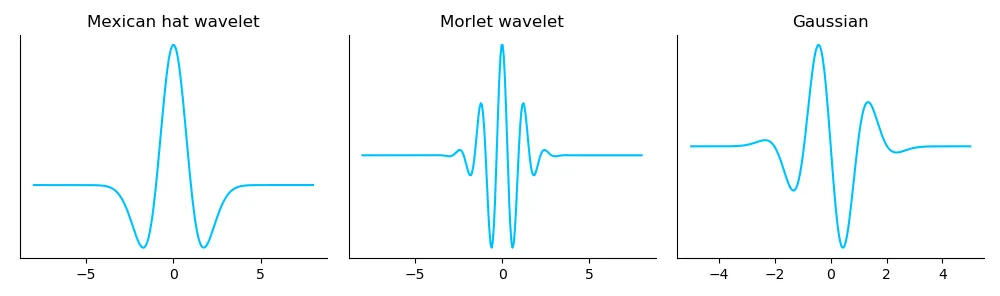
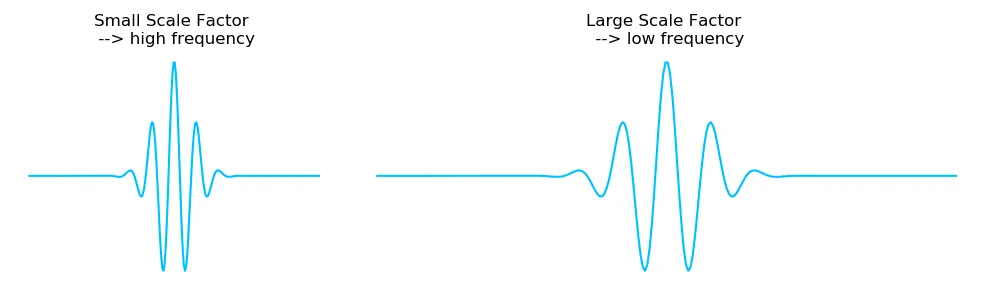
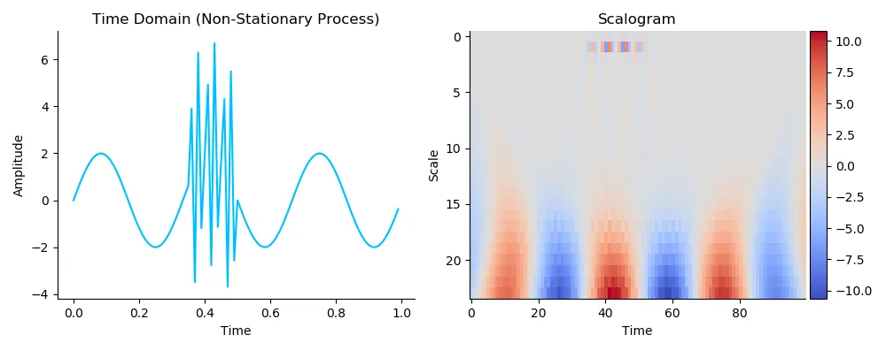
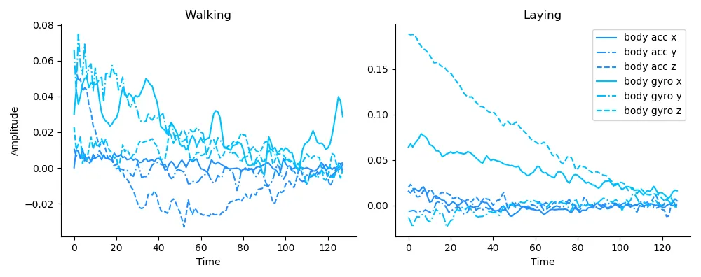
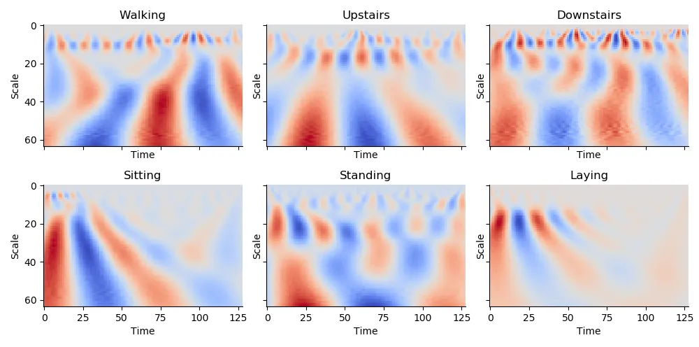
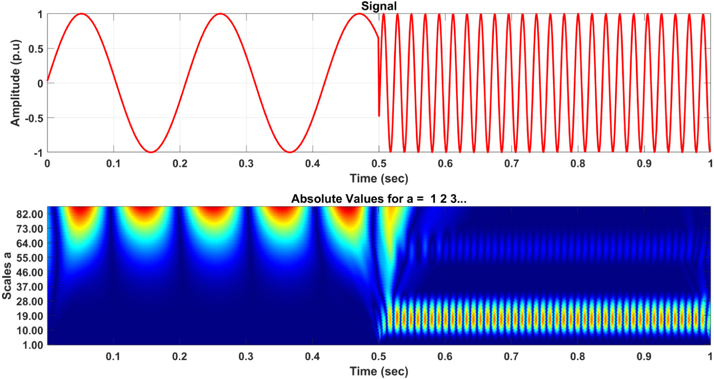

## Wavelet Transformation introduction

The Wavelet Transform (WT) is considered to be a more powerful and preferred method than the Fast Fourier Transform (FFT) for analysing non-stationary time series data due to the following reasons:

1. Wavelet Transform provides better time-frequency localization compared to FFT. While FFT provides frequency information but loses time information, wavelets allow simultaneous analysis of **both time and frequency**. This is particularly useful for non-stationary signals, where the frequency content changes over time.
2. Multi-resolution analysis: Wavelet Transform enables multi-resolution analysis, which means it can analyze signals at **different scales and resolutions**. This is useful for capturing patterns and features at various levels of detail in non-stationary time series data, which might not be possible with just FFT.
3. Better handling of discontinuities: Wavelet Transform can effectively handle signals with **discontinuities and sharp transitions**, which are often present in non-stationary time series data. In contrast, FFT may produce artifacts and spectral leakage when analyzing such signals.

The different wavelet shapes enable us to choose the one that fits best with the features that we are looking for in our signal. Most common wavelets for CWT are the "Mexican, Morlet and Gaussian" wavelet (Figure 1). They are also called "**Mother Wavelets**".

Consequently, the wavelet transformation uses the mother wavelets to divide a 1D to ND time series or image into scaled components. In this connection, the transformation is based on the concepts of scaling and shifting.

- Scaling: stretching or shrinking the signal in time by the scaling factor.
- Shifting: moving the differently-scaled wavelets from the beginning to the end of the signal.

The scale factor corresponds to how much a signal is scaled in time and it is inversely proportional to frequency. This means that the higher the scale, the finer the scale discretion (Figure 2).

Accordingly, this helps:

- stretched wavelets to capture slow changes; and
- shrink wavelets to capture abrupt changes in the signal.

The different wavelets in scales and time are shifted along the entire signal and multiplied by its sampling interval to obtain physical significances, resulting in coefficients that are a function of wavelet scales and shift parameters. For example, a signal with 100 timesteps multiplied by 32 (in a range from 1 to 33) scales results in 3,200 coefficients. This enables better characterizing oscillated behavior in signals with CWT.

If we apply CWT to non-stationary signal and visualize the resulting coefficients in a scalogram, we obtain the following result:

The scalogram above (Figure 3) indicates where most of the energy (see the color bar right of the scalogram) of the original signal is contained in time and frequency. Furthermore, we can see that the characteristics of the signal are now displayed in highly resolved detail. Thereby, you can see the abrupt changes of the burst that are detected by the shrink wavelet with the scale 1 and 2 and the slow changes of the sinus wave by stretched wavelets with a scale of 15 up to 25.

**The abrupt changes are often the most important part of the data both perceptibly and in terms of the information that they provide.**

Such a visualization of the CWT coefficients like the 2D scalogram can be used to improve the distinction between varying types of a signal. In an industrial context, this enables differentiating between different production processes in a machine (process monitoring), identifying components like bearing as well as machine or tools faults (condition monitoring) simply as quality issues (quality monitoring) based on — for example — non-stationary vibration sensor signals. 

For instance, Human Activity Recognition (HAR) dataset contains a smartphone sensors (accelerometer and gyroscope) measuring different people while they are undertaking the 6 activities like walking, walking upstairs, walking downstairs, sitting, staying, laying.

If you plot the body accelerometer and body gyroscope signals of two different activities, you will see dynamically changing (non-stationary) signals for each sample:

Once processed with CWT, as you can see below, it is possible to manually distinguish between the different six HAR activities by visualising the continuous wavelet transformed sensor data via a scalogram.

